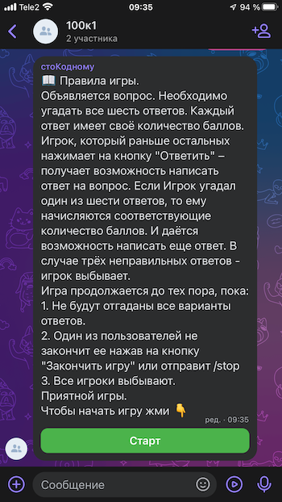

# Чат-бот игра "100 к 1" в социальной сети vk.com

###Бот знает следующие команды:
 * /start - запуск бота для начала игры
 * /stop - Остановка игры и вывод информации о игре

###Правила игры:
Объявляется вопрос. Необходимо угадать все шесть ответов.
Каждый ответ имеет своё количество баллов.
Игрок, который раньше остальных нажимает на кнопку "Ответить"
– получает возможность написать ответ на вопрос.
Если Игрок угадал один из шести ответов, то ему начисляются 
соответствующие количество баллов. И даётся возможность 
написать еще ответ. В случае трёх неправильных ответов
игрок выбывает.
Игра продолжается до тех пора, пока:
1. Не будут отгаданы все варианты ответов.
2. Один из пользователей не закончит ее нажав 
на кнопку "Закончить игру" или отправит /stop

###Демонстрация игры с чат-ботом

####[Основной алгоритм логики игры]('./docs/algorithm.md)
####[Структура чат-бота]('./docs/algorithm.md)

Для игры перейдите по
[ссылке](https://vk.me/join/AJQ1d90x6CUaAmIDZYSRclRo)

