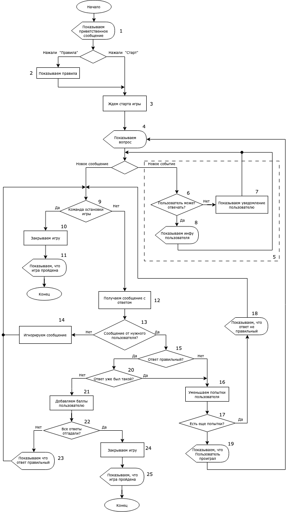

# Общий алгоритм работы чат-бота

## Примечание*
1. Показываем приветственное сообщение с
 двумя кнопками "Правила" и "Начать игру"
2. Показываем правила игры и кнопку "Начать игру"
3. Ждём callback нажатия кнопки "Старт" или сообщение "/start"
4. Получаем случайный вопрос из БД и создаем новую игру в БД. Показываем вопрос и кнопку "Ответить" 
5. Получаем и обрабатываем message_event нажатия кнопки от пользователей
6. Проверяем кто нажал кнопку. Выбыл пользователь из игры или нет (существует игрок и есть ли у него еще попытки ответить)
7. Показываем пользователю "show_snackbar" о том что он проиграл и не может отвечать
8. Создаем Пользователя (если нет) и игрока в БД. Показываем кто первый успел нажать (полное имя пользователя) и что ждём вариант ответа на вопрос от Пользователя
9. Проверяем есть ли в сообщении команда остановки /stop
10. Останавливаем игру (обновляем состояние в БД)
11. Отправляем сообщение, что игру остановил пользователь
12. Получаем новое сообщение от пользователя с ответом на вопрос
13. Проверяем сообщение, оно пришло от того пользователя, кто первым нажал кнопку "Ответить". Имеет возможность ответить(есть еще попытки ответа)
14. Пропускаем сообщение
15. Проверяем правильный ответ прислал пользователь или нет. Создаем в БД новый "Ответ на вопрос"
16. Уменьшаем кол-во попыток ответа у игрока и выводим сообщение, что ответ не правильный
17. Проверяем закончились попытки ответа у пользователя
18. Отправляем сообщение, что:
 - ответ не правильный
 - кол-во оставшихся попыток у пользователя
 - кол-во баллов
 - ждём следующий ответ от него
19. Отправляем сообщение, что:
 - ответ не правильный
 - кол-во попыток
 - пользователь выбывает из игры
20. Проверяем был ли уже такой вопрос
21. Добавляем баллы игроку и обновляем запись в БД
22. Проверяем отгаданы все вопросы или нет
23. Отправляем сообщение, что:
 - ответ правильный
 - кол-во оставшихся попыток у пользователя
 - кол-во баллов
 - ждём следующий ответ от него
24. Обновляем статус игры в БД
25. Отправляем сообщение, что:
 - ответ правильный
 - игра выиграна
 - игроков и их баллы
 - победителя

