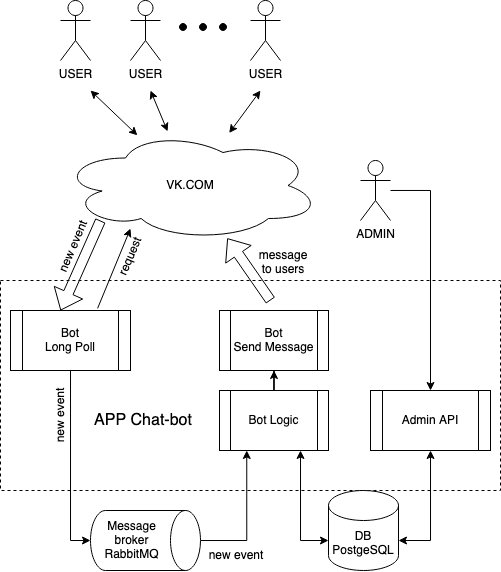
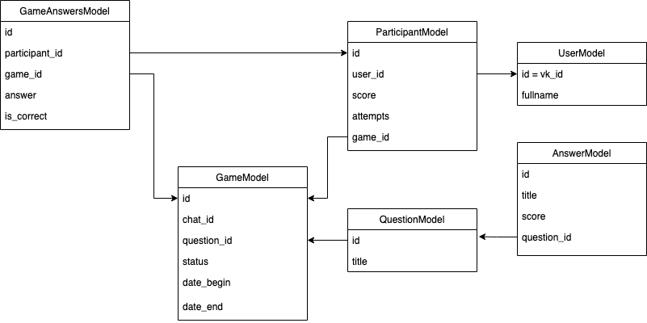

# Структура чат-бота

### Программа Чат-бота разделена на несколько сервисов/блоков:
1. Bot LongPoll - осуществляет:
   - подключение к VK по средству LongPoll
   - приём от VK новых событий (сообщений)
   - добавление новых событий в брокер сообщение RabbitMQ (если указанно в настройках)
2. Bot Logic - осуществляет:
   - забирает новые события из брокера сообщения
   - производит обработку сообщений
   - выполняет основную логику игры
   - сохраняет и загружает данные в базу данных
3. Bot Send Message - осуществляет:
   - отправку сообщений пользователям VK
4. Admin API - осуществляет возможность по api:
   - добавлять новые вопросы
   - получать список вопросов и ответов
   - получать игровую статистику
   

### Cтруктура таблиц базы данных:

